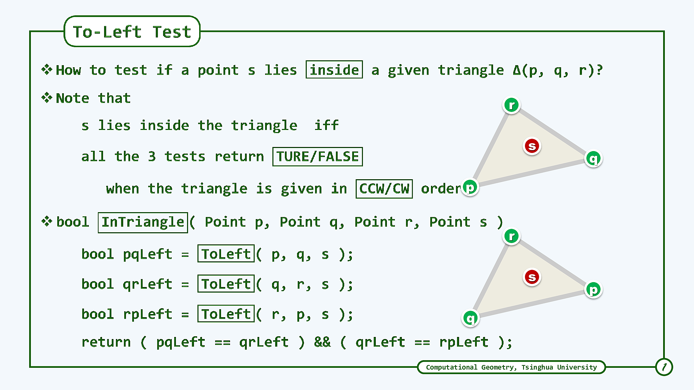

# pdf2img

Convert PDF file to Images, via ImageMagick.

## Demo

**input pdf**

[01-B-04.CH.EP.To-Left-Test.pdf](demo/01-B-04.CH.EP.To-Left-Test.pdf)

**command to convert pdf to images**:

```bash
cd demo && ../pdf2img.sh *.pdf
```

**output images**





if you want to trim empty margin part, uncomment `trim` option in [pdf2img.sh](pdf2img.sh),
so that you can get the trimed version of the first page:


## Pros & Cons

Pros

  - easy to use

Cons

  - perform badly with LaTeX generated PDFs (I don't know why.)

## Acknowledgements

demo pdf come from DENG JunHui's *Computational Graphics* MOOC course.
